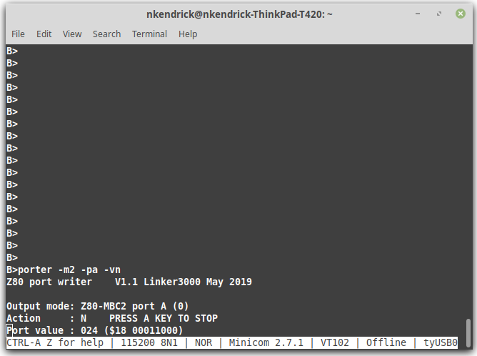
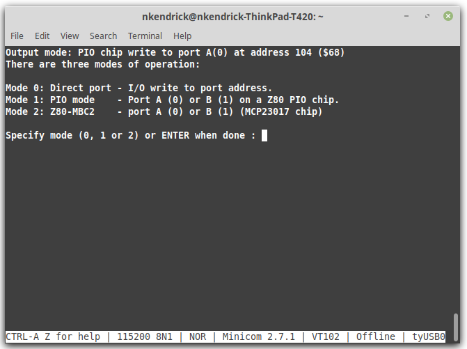

# z80porter

This CP/M program, written in Turbo pascal, can write a range of binary patterns to the specified destination port or I/O chip; it's great for port testing or sending patterns to LEDs. The program has an interactive menu or can be fully driven from the command line. Supplied as both a .com file and source code.

The program works with I/O mapped ports (e.g.: the RC2014 digital I/O board), the Z80 PIO chip (e.g.: the SC103 PIO board for the RC2014 architecture) and the Z80-MBC2 board fitted with an MCP23017 GPIO expander chip.

